# Exact Integer Square and Cube Roots

Here I present simple algorithms *BigIntSqrt* and *BigIntCbrt* for computing exact integer values (truncated towards zero) of square and cube roots of arbitrary integers using only integer arithmetic. These can be used to implement `BigInt` equivalents of `Math.sqrt` and `Math.cbrt` in ECMAScript.
Both algorithms are efficient, taking only log(log(*n*)) operations to compute square or cube roots of *n*.
I'm also including proofs that these algorithms compute the exact results for all inputs:

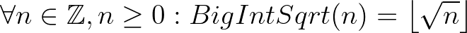
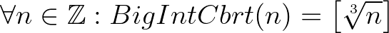

— *Waldemar Horwat*
— *May 2022*

## Notation

All math operations have their usual mathematical meanings on real numbers.

* As is the [convention in mathematics](https://en.wikipedia.org/wiki/Positive_real_numbers), a **positive** real number or integer means that it's greater than zero; similarly a **negative** real number or integer means that it's less than zero. The integer or real number zero is neither positive nor negative.
* ⌊*x*⌋ is the floor of the real number *x* (i.e. truncated towards -∞ to an integer):<br>
⌊7.1⌋ = 7, ⌊–3.2⌋ = –4, ⌊5⌋ = 5, ⌊–2⌋ = –2.
* [*x*] is the real number *x* truncated towards 0 to an integer:<br>
[7.1] = 7, [–3.2] = –3, [5] = 5, [–2] = –2.

We can combine [*x*] with division to denote integer division truncating towards 0:

* 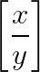 is the quotient of *x* divided by *y* truncated towards 0 to an integer:<br>
[17/5] = [3.4] = 3, [–7/2] = [–3.5] = –3, [10/2] = 5.<br>
When *x* and *y* are integers, this is the same as ECMAScript's `BigInt` division of *x* and *y*.

When *x* ≥ 0 and *y* > 0, the result of *x*/*y* is nonnegative, so truncating it towards 0 is the same as truncating it towards -∞.

* In such nonnegative cases we'll sometimes use 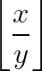 instead of . In those cases they're equivalent and both denote ECMAScript's `BigInt` division of *x* and *y*.


# ECMAScript Algorithms

## Bit-Size

We'll need a helper function *BigIntLog2* that, given a positive integer *n*, returns the position of its most significant set bit when expressed in binary. For example, *BigIntLog2*(1) = 0, *BigIntLog2*(2) = 1, *BigIntLog2*(255) = 7, *BigIntLog2*(256) = 8.<br>
Mathematically *BigIntLog2* is defined as

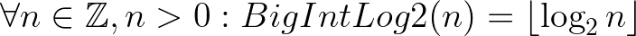

To put it another way, *BigIntLog2*(*n*) is the integer *w* that satisfies 2<sup>*w*</sup> ≤ *n* < 2<sup>*w*+1</sup>.

We'll assume we have an efficient ECMAScript implementation of *BigIntLog2* that takes a positive `BigInt` and returns a `BigInt` greater than or equal to zero.

## BigIntSqrt

We implement *BigIntSqrt* as follows. For simplicity we assume that the argument *n* has already been checked to be a `BigInt`.

```js
function BigIntSqrt(n) {
  if (n < 0n)
    throw RangeError("Square root of negative BigInt");
  if (n === 0n)
    return 0n;
  const w = BigIntLog2(n);  // BigIntLog2 returns a BigInt
  let x = 1n << (w >> 1n);  // x is the initial guess x0 here
  let next = (x + n/x) >> 1n;
  do {
    x = next;
  } while ((next = (x + n/x) >> 1n) < x);
  return x;
}
```

All numbers are nonnegative, so the right-shifts by 1 are equivalent to dividing by 2.

### Examples

If we step through `BigIntSqrt(123456n)`, we get the following values of *x*, *w*, and the final *next*:

- *w* = `16n`
- *x*<sub>0</sub> = `256n`
- *x*<sub>1</sub> = `369n`
- *x*<sub>2</sub> = `351n`
- *next* = `351n`

and the result is *x*<sub>2</sub> = `351n`.

Occasionally the final *next* can be greater than the last value of *x*, as in `BigIntSqrt(80n)`:

- *w* = `6n`
- *x*<sub>0</sub> = `8n`
- *x*<sub>1</sub> = `9n`
- *x*<sub>2</sub> = `8n`
- *next* = `9n`

where the result is *x*<sub>2</sub> = `8n`.

The algorithm converges rapidly, using log(log(*n*)) iterations. Let's take the square root of a googol:

`BigIntSqrt(10n**100n)`

- *w* = `332n`
- *x*<sub>0</sub> = `93536104789177786765035829293842113257979682750464n`
- *x*<sub>1</sub> = `100223346596432806305328643989950694205293778977332n`
- *x*<sub>2</sub> = `100000248862684355295361037376723795016205636438280n`
- *x*<sub>3</sub> = `100000000000309662407688436639554331697921065069655n`
- *x*<sub>4</sub> = `100000000000000000000000479454033675513027179143720n`
- *x*<sub>5</sub> = `100000000000000000000000000000000000000000000001149n`
- *x*<sub>6</sub> = `100000000000000000000000000000000000000000000000000n`
- *next* = `100000000000000000000000000000000000000000000000000n`

with the correct answer *x*<sub>6</sub> = 10<sup>50</sup>.

Let's figure out the exact values of the first 101 decimal digits of the square root of 2:

`BigIntSqrt(2n * 10n**200n)`

- *w* = `665n`
- *x*<sub>0</sub> = `8749002899132047697490008908470485461412677723572849745703082425639811996797503692894052708092215296n`
- *x*<sub>1</sub> = `15804375362388773670902839937288652325225438810014411485002799645096232357466133803201506572647827944n`
- *x*<sub>2</sub> = `14229549421664044022085597366571792103664648001192143121732144276497668172208742442918179650436359389n`
- *x*<sub>3</sub> = `14142404120358730362124525665217767401060790557815075015694913950869126908913392090386697015371402453n`
- *x*<sub>4</sub> = `14142135626279684017183484419478198323023092160355018411871574810862373478578236444214290814824160615n`
- *x*<sub>5</sub> = `14142135623730950488246557030817812967256722016462383289181725954672117314556926820527863606311500271n`
- *x*<sub>6</sub> = `14142135623730950488016887242096980785698583684684248602001325910890328013825461394333000393858369222n`
- *x*<sub>7</sub> = `14142135623730950488016887242096980785696718753769480731766797379907324784621070511468589068012098747n`
- *x*<sub>8</sub> = `14142135623730950488016887242096980785696718753769480731766797379907324784621070388503875343276415727n`
- *next* = `14142135623730950488016887242096980785696718753769480731766797379907324784621070388503875343276415727n`

The result *x*<sub>8</sub> is ⌊10<sup>100</sup> √2⌋, so √2 = 1.4142135623730950488016887242096980785696718753769480731766797379907324784621070388503875343276415727…

### Small Value Optimization

We can add an optimization that computes *BigIntSqrt* directly using floating-point arithmetic for *n* small enough that `Math.sqrt` on *n* converted to a `Number` is accurate to within a few least significant bits. The threshold of what counts as "small enough" varies depending on the implementation accuracy of `Math.sqrt`, but 2<sup>44</sup> should be safe for any reasonable implementation.

```
function BigIntSqrt(n) {
  if (n < 0n)
    throw RangeError("Square root of negative BigInt");
  if (n < 0x100000000000n) {  // 2^44
    return BigInt(Math.floor(Math.sqrt(Number(n) + 0.5)));
  }
  ... rest as before
```

Adding 0.5 to *n* avoids potential problems if *n* is a perfect square of an integer *s*<sup>2</sup> but `Math.sqrt` is slightly inaccurate and produces an approximation that's slightly below *s*.


# Explanation

Now let's delve into how and why the algorithms work. They are based on Newton's method.

## Newton's Method on Real Numbers

The basic approach of computing the square or cube root of *n* is based on solving the equation *x*<sup>2</sup> – *n* = 0 or *x*<sup>3</sup> – *n* = 0 for a real number *x*. We can do this by starting with an initial guess *x*<sub>0</sub> and then using a variant of [Newton's method](https://en.wikipedia.org/wiki/Newton%27s_method) to refine it to produce successive approximations *x*<sub>1</sub>, *x*<sub>2</sub>, and so on until we find the desired answer. Let's first take a look at how Newton's method works on real numbers:

Given an approximation *x*<sub>*i*</sub> to a root of the equation *f*(*x*) = 0, [Newton's method](https://en.wikipedia.org/wiki/Newton%27s_method) produces the next approximation

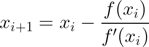

For computing square roots we're looking for roots of *f*(*x*) = *x*<sup>2</sup> – *n* so Newton's method becomes


For cube roots we're looking for roots of *f*(*x*) = *x*<sup>3</sup> – *n*, in which case Newton's method becomes

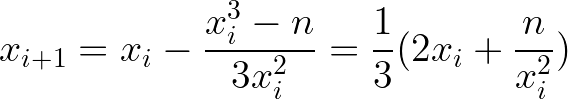

These will produce an infinite series of successively more accurate real number approximations of the square or cube root of *n*.

## Computing Square Roots

The basic Newton's method uses real numbers and produces an infinite series of approximations. Let's modify it to use only integer arithmetic to find integer square roots truncated towards 0. Later we'll show that we'll arrive at the exact answer in finitely many operations. A similar algorithm is described on [Wikipedia's entry on integer square roots](https://en.wikipedia.org/wiki/Integer_square_root) but without the detailed proof of correctness.

## Square Root Algorithm

The algorithm used to compute *BigIntSqrt*(*n*) where *n* is a nonnegative integer can be stated mathematically as follows:

If *n* = 0, then return 0. Otherwise, let

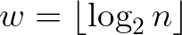
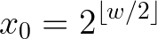

For *i* = 0, 1, 2, 3, … compute the series

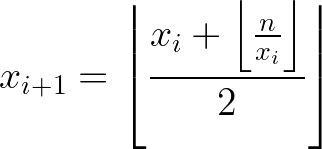

until we find the lowest *k* > 0 such that *x*<sub>*k*+1</sub> ≥ *x*<sub>*k*</sub>. Return *x*<sub>*k*</sub>.

Later we will prove that our search for such a *k* terminates and that *x*<sub>*k*</sub> satisfies

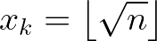


# Proof
## Lemmas

Let's start with a few [lemmas about the floor function](https://en.wikipedia.org/wiki/Floor_and_ceiling_functions#Equivalences).

Given a real number *x*, ⌊*x*⌋ is the unique integer *i* such that *x* = *i* + *f* and 0 ≤ *f* < 1. From that we can derive the following lemmas.

#### Lemma 1

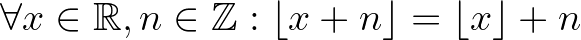

This is obvious from the definition of ⌊*x*⌋.

#### Lemma 2

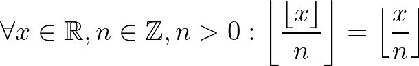

To prove this, let *x* = *i* + *f* where *i* is an integer and 0 ≤ *f* < 1. Then let *i* = *jn* + *k* where *j* and *k* are integers and 0 ≤ *k* ≤ *n* – 1. Then we have 0 ≤ *k* + *f* < *n* and thus


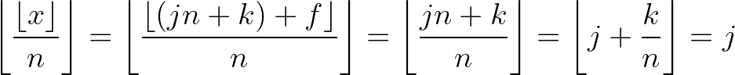

#### Lemma 3

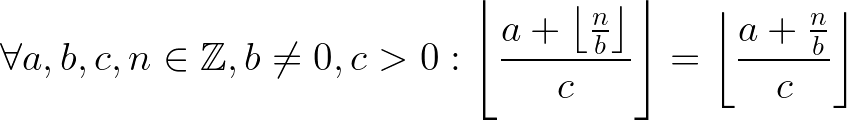

Proof: By lemmas 1 and 2 we have

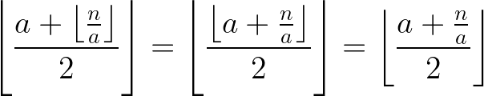

### Series

Recall that the series for computing *BigIntSqrt*(*n*) when integer *n* > 0 consists of

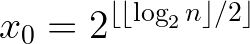


Also let's define

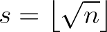

Given *n* ≥ 1, we have *s* ≥ 1 and *x*<sub>0</sub> is an integer greater than 0. All subsequent terms of the series are obviously also integers. Next we'll show by induction that all terms after the zeroth one are greater than or equal to *s*.

#### Lower bound on series terms

Suppose *x*<sub>*i*</sub> ≥ 1. We'll show that *x*<sub>*i*+1</sub> ≥ *s*.

The square of a real number is nonnegative, so we have

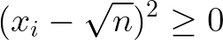

We can divide both sides by the positive quantity 2*x*<sub>*i*</sub> and simplify to get

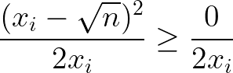
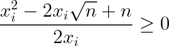
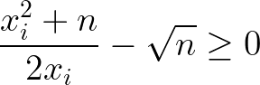
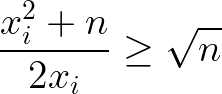
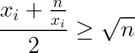

Taking the floor of both sides and then using lemma 3 we get

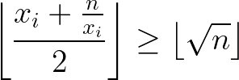
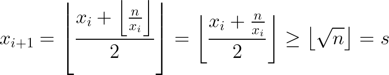

This completes the induction.

#### Upper bound on series terms

Suppose *x*<sub>*i*</sub> > *s*, which is true for all *i* > 0. We'll show that *x*<sub>*i+1*</sub> < *x*<sub>*i*</sub> so the series is strictly decreasing as long as terms are greater than *s*.

*x*<sub>*i*</sub> is an integer, so *x*<sub>*i*</sub> > *s* implies

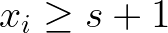

By the definition of *s*, we get

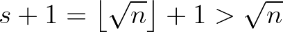
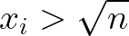
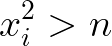
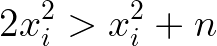

Dividing both sides by the positive value 2*x*<sub>*i*</sub> we get

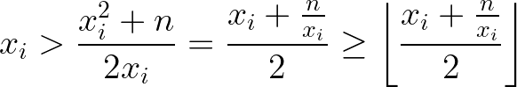

Applying lemma 3 yields the upper bound on *x*<sub>*i*+1</sub>.

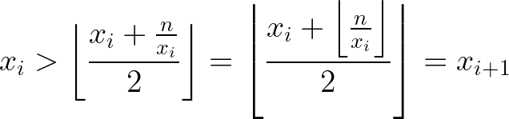

Combining the upper bound with the lower bound, we get

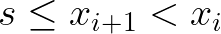

There are only finitely many integers between *s* and *x*<sub>*i*</sub> so the series must decrease on each step (other than the zeroth because we don't necessarily have *x*<sub>0</sub> > *s*) and eventually reach *x*<sub>*k*</sub> = *s* for some *k*. At that point the series cannot decrease further, so we can detect *x*<sub>*k*</sub> = *s* when *k* > 0 and *x*<sub>*k+1*</sub> ≥ *x*<sub>*k*</sub>.

The convergence is rapid, reaching *s* in O(log(log(*n*))) iterations, but the proof of the time bound is a bit more complicated and not needed here.

# Cube Root Algorithm
