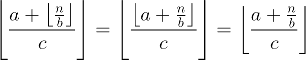

# Exact Integer Roots

Here are simple algorithms *BigIntSqrt* and *BigIntCbrt* for computing exact integer values (truncated towards zero) of square and cube roots of arbitrary integers using only integer arithmetic.  These can be used to implement `BigInt` equivalents of `Math.sqrt` and `Math.cbrt` in ECMAScript.
Both algorithms are efficient, taking only log(log(*n*)) operations to compute square or cube roots of *n*.
I'm also including proofs that these algorithms compute the exact results for all inputs:


## Notation

All operations have their usual mathematical meanings on real numbers.

* ⌊*x*⌋ is the floor of the real number *x* (i.e. truncated towards -∞ to an integer):<br>
⌊7.1⌋ = 7, ⌊–3.2⌋ = –4, ⌊5⌋ = 5, ⌊–2⌋ = –2.
* [*x*] is the real number *x* truncated towards 0 to an integer:<br>
[7.1] = 7, [–3.2] = –3, [5] = 5, [–2] = –2.

We can combine [*x*] with division to denote integer division truncating towards 0:

*  is the quotient of *x* divided by *y* truncated towards 0 to an integer:<br>
[17/5] = [3.4] = 3, [–7/2] = [–3.5] = –3, [10/2] = 5.<br>
When *x* and *y* are integers, this is the same as ECMAScript's `BigInt` division of *x* and *y*.

When *x* ≥ 0 and *y* > 0, the result of *x*/*y* is nonnegative, so truncating it towards 0 is the same as truncating it towards -∞.

* In such nonnegative cases we'll sometimes use  instead of . In those cases they're equivalent and both denote ECMAScript's `BigInt` division of *x* and *y*.

## Bit-Size

We'll need a helper function *BigIntLog2* that, given a positive integer *n*, returns the position of its most significant set bit when expressed in binary. For example, *BigIntLog2*(1) = 0, *BigIntLog2*(2) = 1, *BigIntLog2*(255) = 7, *BigIntLog2*(256) = 8.<br>
Mathematically *BigIntLog2* is defined as


# Newton's Method on Real Numbers

The basic approach of computing the square or cube root of *n* is based on solving the equation *x*<sup>2</sup> – *n* = 0 or *x*<sup>3</sup> – *n* = 0 for a real number *x*. We can do this by starting with an initial guess *x*<sub>0</sub> and then using a variant of [Newton's method](https://en.wikipedia.org/wiki/Newton%27s_method) to refine it to produce successive approximations *x*<sub>1</sub>, *x*<sub>2</sub>, and so on until we find the desired answer. Let's first take a look at how Newton's method works on real numbers:

Given an approximation *x*<sub>*i*</sub> to a root of the equation *f*(*x*) = 0, [Newton's method](https://en.wikipedia.org/wiki/Newton%27s_method) produces the next approximation


For computing square roots we're looking for roots of *f*(*x*) = *x*<sup>2</sup> – *n* so Newton's method becomes


For cube roots we're looking for roots of *f*(*x*) = *x*<sup>3</sup> – *n*, in which case Newton's method becomes


These will produce an infinite series of successively more accurate real number approximations of the square or cube root of *n*.

# Computing Square Roots

The basic Newton's method uses real numbers and produces an infinite series of approximations. Let's modify it to use only integer arithmetic to find integer square roots truncated towards 0. Later we'll show that we'll arrive at the exact answer in finitely many (in fact only log(log(*n*))) operations. A similar algorithm is described on [Wikipedia's entry on integer square roots](https://en.wikipedia.org/wiki/Integer_square_root) but without the detailed proof of correctness.

# Square Root Algorithm

The approach for computing *BigIntSqrt*(*n*) of integer *n* ≥ 0 is as follows:

If *n* = 0, then return 0. Otherwise, let


For *i* = 0, 1, 2, 3, … compute the series


until we find the lowest *k* > 0 such that *x*<sub>*k*+1</sub> ≥ *x*<sub>*k*</sub>. Return *x*<sub>*k*</sub>.

We will prove that our search for such a *k* terminates and that *x*<sub>*k*</sub> satisfies


## ECMAScript

We implement the above algorithm as follows. For simplicity we assume that the argument *n* is a `BigInt`; an actual implementation should check.

```js
function BigIntSqrt(n) {
  if (n < 0n)
    throw RangeError("Square root of negative BigInt");
  if (n === 0n)
    return 0n;
  const w = BigIntLog2(n);  // BigIntLog2 returns a BigInt
  let x = 1n << (w >> 1n);  // x is the initial guess x0 here
  let next = (x + n/x)/2n;
  do {
    x = next;
  } while ((next = (x + n/x)/2n) < x);
  return x;
}
```

## Proof
### Lemmas

Let's start with a few [lemmas about the floor function](https://en.wikipedia.org/wiki/Floor_and_ceiling_functions#Equivalences).

Given a real number *x*, ⌊*x*⌋ is the unique integer *i* such that *x* = *i* + *f* and 0 ≤ *f* < 1. From that we can derive the following lemmas.

#### Lemma 1


This is obvious from the definition of ⌊*x*⌋.

#### Lemma 2


To prove this, let *x* = *i* + *f* where *i* is an integer and 0 ≤ *f* < 1. Then let *i* = *jn* + *k* where *j* and *k* are integers and 0 ≤ *k* ≤ *n* – 1. Then we have 0 ≤ *k* + *f* < *n* and thus


#### Lemma 3


Proof: By lemmas 1 and 2 we have



### Series

Recall that the series for computing *BigIntSqrt*(*n*) when integer *n* > 0 consists of


Given *n* ≥ 1, *x*<sub>0</sub> is an integer greater than 0. All subsequent terms of the series are obviously also integers.

Define


## Small Value Optimization

# Cube Root Algorithm

## Proof

## Scratchpad


