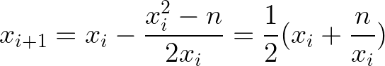

# Exact Integer Roots

Here are simple algorithms *BigIntSqrt* and *BigIntCbrt* for computing exact integer values (truncated towards zero) of square and cube roots of arbitrary integers using only integer arithmetic.  These can be used to implement `BigInt` equivalents of `Math.sqrt` and `Math.cbrt` in ECMAScript.
Both algorithms are efficient, taking only log(log(*n*)) operations to compute square or cube roots of *n*.
I'm also including proofs that these algorithms compute the exact results for all inputs:

## Notation

All operations have their usual mathematical meanings on real numbers.

* ⌊*x*⌋ is the floor of the real number *x* (i.e. truncated towards -∞ to an integer): ⌊7.1⌋ = 7, ⌊–3.2⌋ = –4, ⌊5⌋ = 5, ⌊–2⌋ = –2
* [*x*] is the real number *x* truncated towards 0 to an integer: [7.1] = 7, [–3.2] = –3, [5] = 5, [–2] = –2

We can combine [*x*] with division to denote integer division truncating towards 0:

*  is the quotient of *x* divided by *y* truncated towards 0 to an integer: [17/5] = [3.4] = 3, [–7/2] = [–3.5] = –3, [10/2] = 5. When *x* and *y* are integers, this is the same as ECMAScript's `BigInt` division of *x* and *y*.

When *x* ≥ 0 and *y* > 0, the result of *x*/*y* is nonnegative, so truncating it towards 0 is the same as truncating it towards -∞.

* In such nonnegative cases we'll sometimes use  instead of . In the nonnegative cases both denote ECMAScript's `BigInt` division of *x* and *y*.

# Approach

The fundamental approach of computing the exact square or cube root of *n* truncated to an integer is based on solving the equation *x*2 – *n* = 0 or *x*3 – *n* = 0 for a real number *x*. We can do this by starting with an initial guess *x*0 and then using a variant of [Newton's method](https://en.wikipedia.org/wiki/Newton%27s_method) to refine it to produce successive approximations *x*1, *x*2, and so on until we find the desired answer. Although Newton's method uses real numbers, we'll show that we can use it using only integer arithmetic in the *BigIntSqrt* and *BigIntCbrt* algorithms and we'll arrive at the exact answer in finitely many (in fact only log(log(*n*))) operations.

Given an approximation *x**i* to a root of the equation *f*(*x*) = 0, [Newton's method](https://en.wikipedia.org/wiki/Newton%27s_method) produces the next approximation

For computing square roots we're looking for roots of *f*(*x*) = *x*2 – *n* so Newton's method becomes

For cube roots we're looking for roots of *f*(*x*) = *x*3 – *n*, in which case Newton's method becomes

# Square Root Algorithm

## Proof

## Small Value Optimization

# Cube Root Algorithm

## Proof

## Scratchpad

