# Exact Integer Square and Cube Roots

Here I present simple algorithms *BigIntSqrt* and *BigIntCbrt* for computing exact integer values (truncated towards zero) of square and cube roots of arbitrary integers using only integer arithmetic. These can be used to implement `BigInt` equivalents of `Math.sqrt` and `Math.cbrt` in ECMAScript.
Both algorithms are efficient, taking only log(log(*n*)) operations to compute square or cube roots of *n*.
I'm also including proofs that these algorithms compute the exact results for all inputs:


The goal is to get *BigIntSqrt* and *BigIntCbrt* included in the ECMAScript language under some suitable name in the effort to extend `Math` library functions such as `Math.abs` to also cover `BigInt` (the exact form and whether they'll be overloads or separate functions are to be decided). This is preferable to having users blindly copy snippets they find “on the net”. For example, at the time of this writing the top Google search result for "javascript bigint sqrt" produces a link to a buggy and needlessly slow ECMAScript algorithm that sometimes produces incorrect answers, such when computing the square root of 4.

— *Waldemar Horwat*
— *May 2022*


## Notation

All math operations have their usual mathematical meanings on real numbers.

* As is the [convention in mathematics](https://en.wikipedia.org/wiki/Positive_real_numbers), a **positive** real number or integer means that it's greater than zero; similarly a **negative** real number or integer means that it's less than zero. The integer or real number zero is neither positive nor negative.
* ⌊*x*⌋ is the floor of the real number *x* (i.e. truncated towards -∞ to an integer):<br>
⌊7.1⌋ = 7, ⌊–3.2⌋ = –4, ⌊5⌋ = 5, ⌊–2⌋ = –2.
* [*x*] is the real number *x* truncated towards 0 to an integer:<br>
[7.1] = 7, [–3.2] = –3, [5] = 5, [–2] = –2.

We can combine [*x*] with division to denote integer division truncating towards 0:

*  is the quotient of *x* divided by *y* truncated towards 0 to an integer:<br>
[17/5] = [3.4] = 3, [–7/2] = [–3.5] = –3, [10/2] = 5.<br>
When *x* and *y* are integers, this is the same as ECMAScript's `BigInt` division of *x* and *y*.

When *x* ≥ 0 and *y* > 0, the result of *x*/*y* is nonnegative, so truncating it towards 0 is the same as truncating it towards -∞.

* In such nonnegative cases we'll sometimes use  instead of . In those cases they're equivalent and both denote ECMAScript's `BigInt` division of *x* and *y*.


# ECMAScript Algorithms

## Bit-Size

We'll need a helper function *BigIntLog2* that, given a positive integer *n*, returns the position of its most significant set bit when expressed in binary. For example, *BigIntLog2*(1) = 0, *BigIntLog2*(2) = 1, *BigIntLog2*(255) = 7, *BigIntLog2*(256) = 8.

Mathematically *BigIntLog2* is defined as


To put it another way, *BigIntLog2*(*n*) is the integer *w* that satisfies 2<sup>*w*</sup> ≤ *n* < 2<sup>*w*+1</sup>.

We'll assume we have an efficient ECMAScript implementation of *BigIntLog2* that takes a positive `BigInt` and returns a `BigInt` greater than or equal to zero.

## BigIntSqrt

We implement *BigIntSqrt* in ECMAScript as follows. For simplicity we assume that the argument *n* has already been checked to be a `BigInt`.

```js
function BigIntSqrt(n) {
  if (n < 0n)
    throw RangeError("Square root of negative BigInt");
  if (n === 0n)
    return 0n;
  const w = BigIntLog2(n);  // BigIntLog2 returns a BigInt
  let x = 1n << (w >> 1n);  // x is the initial guess x0 here
  let next = (x + n/x) >> 1n;
  do {
    x = next;
  } while ((next = (x + n/x) >> 1n) < x);
  return x;
}
```

All numbers are nonnegative, so the right-shifts by 1 are equivalent to dividing by 2.

### Examples

If we step through `BigIntSqrt(123456n)`, we get the following values of *x*, *w*, and the final *next*:

- *w* = `16n`
- *x*<sub>0</sub> = `256n`
- *x*<sub>1</sub> = `369n`
- *x*<sub>2</sub> = `351n`
- *next* = `351n`

and the result is *x*<sub>2</sub> = `351n`.

Occasionally the final *next* can be greater than the last value of *x*, as in `BigIntSqrt(80n)`:

- *w* = `6n`
- *x*<sub>0</sub> = `8n`
- *x*<sub>1</sub> = `9n`
- *x*<sub>2</sub> = `8n`
- *next* = `9n`

where the result is *x*<sub>2</sub> = `8n`.

The algorithm converges rapidly, using log(log(*n*)) iterations. Let's take the square root of a googol:

`BigIntSqrt(10n**100n)`

- *w* = `332n`
- *x*<sub>0</sub> = `93536104789177786765035829293842113257979682750464n`
- *x*<sub>1</sub> = `100223346596432806305328643989950694205293778977332n`
- *x*<sub>2</sub> = `100000248862684355295361037376723795016205636438280n`
- *x*<sub>3</sub> = `100000000000309662407688436639554331697921065069655n`
- *x*<sub>4</sub> = `100000000000000000000000479454033675513027179143720n`
- *x*<sub>5</sub> = `100000000000000000000000000000000000000000000001149n`
- *x*<sub>6</sub> = `100000000000000000000000000000000000000000000000000n`
- *next* = `100000000000000000000000000000000000000000000000000n`

with the correct answer *x*<sub>6</sub> = 10<sup>50</sup>.

Let's figure out the exact values of the first 101 decimal digits of the square root of 2:

`BigIntSqrt(2n * 10n**200n)`

- *w* = `665n`
- *x*<sub>0</sub> = `8749002899132047697490008908470485461412677723572849745703082425639811996797503692894052708092215296n`
- *x*<sub>1</sub> = `15804375362388773670902839937288652325225438810014411485002799645096232357466133803201506572647827944n`
- *x*<sub>2</sub> = `14229549421664044022085597366571792103664648001192143121732144276497668172208742442918179650436359389n`
- *x*<sub>3</sub> = `14142404120358730362124525665217767401060790557815075015694913950869126908913392090386697015371402453n`
- *x*<sub>4</sub> = `14142135626279684017183484419478198323023092160355018411871574810862373478578236444214290814824160615n`
- *x*<sub>5</sub> = `14142135623730950488246557030817812967256722016462383289181725954672117314556926820527863606311500271n`
- *x*<sub>6</sub> = `14142135623730950488016887242096980785698583684684248602001325910890328013825461394333000393858369222n`
- *x*<sub>7</sub> = `14142135623730950488016887242096980785696718753769480731766797379907324784621070511468589068012098747n`
- *x*<sub>8</sub> = `14142135623730950488016887242096980785696718753769480731766797379907324784621070388503875343276415727n`
- *next* = `14142135623730950488016887242096980785696718753769480731766797379907324784621070388503875343276415727n`

The result *x*<sub>8</sub> is ⌊10<sup>100</sup> √2⌋, so √2 = 1.4142135623730950488016887242096980785696718753769480731766797379907324784621070388503875343276415727…

### Small value optimization

We can add an optimization that computes *BigIntSqrt* directly using floating-point arithmetic for *n* small enough that `Math.sqrt` on *n* converted to a `Number` is accurate to within a few least significant bits. The threshold of what counts as "small enough" varies depending on the implementation accuracy of `Math.sqrt`, but 2<sup>44</sup> should be safe for any reasonable implementation.

```js
function BigIntSqrt(n) {
  if (n < 0n)
    throw RangeError("Square root of negative BigInt");
  if (n < 0x100000000000n) {  // 2^44
    return BigInt(Math.floor(Math.sqrt(Number(n) + 0.5)));
  }
  ... rest as before
```

Adding 0.5 to *n* avoids potential problems if *n* is a perfect square of an integer *s*<sup>2</sup> but `Math.sqrt` is slightly inaccurate and produces an approximation that's slightly below *s*.


## BigIntCbrt

We implement *BigIntCbrt* as follows, which produces the cube root of *n* truncated towards zero. Once again we assume that the argument *n* has already been checked to be a `BigInt`.

```js
function BigIntCbrt(n) {
  if (n < 0n)
    return -BigIntCbrt(-n);
  if (n === 0n)
    return 0n;
  const w = BigIntLog2(n);  // BigIntLog2 returns a BigInt
  let x = 1n << (w / 3n);  // x is the initial guess x0 here
  let next = (2n*x + n/(x*x)) / 3n;
  do {
    x = next;
  } while ((next = (2n*x + n/(x*x)) / 3n) < x);
  return x;
}
```

### Examples

If we step through `BigIntCbrt(125n)`, we get the following values of *x*, *w*, and the final *next*:

- *w* = `6n`
- *x*<sub>0</sub> = `4n`
- *x*<sub>1</sub> = `5n`
- *next* = `5n`

and the result is *x*<sub>1</sub> = `5n`.

Let's take the cube root of a googol:

`BigIntCbrt(10n**100n)`

- *w* = `332n`
- *x*<sub>0</sub> = `1298074214633706907132624082305024n`
- *x*<sub>1</sub> = `2843626090122429343812008194362090n`
- *x*<sub>2</sub> = `2307975193491828189478923582864817n`
- *x*<sub>3</sub> = `2164422626317660162834416053331641n`
- *x*<sub>4</sub> = `2154480709428036015136058273653333n`
- *x*<sub>5</sub> = `2154434691014844364863943029148908n`
- *x*<sub>6</sub> = `2154434690031883722207769275611571n`
- *x*<sub>7</sub> = `2154434690031883721759293566519350n`
- *next* = `2154434690031883721759293566519350n`

with the answer *x*<sub>7</sub> = 2154434690031883721759293566519350, which is the first 34 digits of the decimal representation of the cube root of 10.

### Small value optimization

As with *BigIntSqrt*, we can do an optimization for small values of *n*:

```js
function BigIntCbrt(n) {
  if (n < 0n)
    return -BigIntCbrt(-n);
  if (n < 0x100000000000n) {  // 2^44
    return BigInt(Math.floor(Math.cbrt(Number(n) + 0.5)));
  }
  ... rest as before
```


# Explanation

Now let's delve into how and why the *BigIntSqrt* and *BigIntCbrt* algorithms work.

## Newton's Method on Real Numbers

The basic approach of computing the square or cube root of *n* is based on solving the equation *x*<sup>2</sup> – *n* = 0 or *x*<sup>3</sup> – *n* = 0 for a real number *x*. We can do this by starting with an initial guess *x*<sub>0</sub> and then using a variant of [Newton's method](https://en.wikipedia.org/wiki/Newton%27s_method) to refine it to produce successive approximations *x*<sub>1</sub>, *x*<sub>2</sub>, and so on until we find the desired answer. Let's first take a look at how Newton's method works on real numbers:

Given an approximation *x*<sub>*i*</sub> to a root of the equation *f*(*x*) = 0, [Newton's method](https://en.wikipedia.org/wiki/Newton%27s_method) produces the next approximation


For computing square roots we're looking for roots of *f*(*x*) = *x*<sup>2</sup> – *n* so Newton's method becomes


For cube roots we're looking for roots of *f*(*x*) = *x*<sup>3</sup> – *n*, in which case Newton's method becomes


These will produce an infinite series of successively more accurate real number approximations of the square or cube root of *n*.

## Newton's Method on Integers

The standard Newton's method uses real numbers and produces an infinite series of approximations. Let's modify it to use only integer arithmetic to find integer square or cube roots truncated towards 0. Later we'll show that we'll arrive at the exact answer in finitely many operations. A similar algorithm for square roots is described on [Wikipedia's entry on integer square roots](https://en.wikipedia.org/wiki/Integer_square_root) but without the detailed proof of correctness.

### Square Root Algorithm

The algorithm that implements *BigIntSqrt*(*n*) where *n* is a nonnegative integer can be stated mathematically as follows:

If *n* = 0, then return 0. Otherwise, let


For *i* = 0, 1, 2, 3, … compute the series


until we find the lowest *k* > 0 such that *x*<sub>*k*+1</sub> ≥ *x*<sub>*k*</sub>. Return *x*<sub>*k*</sub>.

Later we will prove that our search for such a *k* terminates and that *x*<sub>*k*</sub> satisfies


### Cube Root Algorithm

The algorithm that implements *BigIntCbrt*(*n*) where *n* is any integer can be stated mathematically as follows:

If *n* = 0, then return 0.

If *n* < 0, then return –*BigIntCbrt*(–*n*).

Otherwise *n* is positive. Let


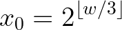

For *i* = 0, 1, 2, 3, … compute the series

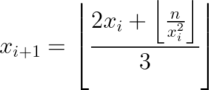

until we find the lowest *k* > 0 such that *x*<sub>*k*+1</sub> ≥ *x*<sub>*k*</sub>. Return *x*<sub>*k*</sub>.

Later we will prove that our search for such a *k* terminates and that *x*<sub>*k*</sub> satisfies

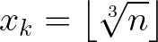


# Proofs

## Lemmas

Let's start with a few [lemmas about the floor function](https://en.wikipedia.org/wiki/Floor_and_ceiling_functions#Equivalences).

Given a real number *x*, ⌊*x*⌋ is the unique integer *i* such that *x* = *i* + *f* and 0 ≤ *f* < 1. From that we can derive the following lemmas.

#### Lemma 1


This is obvious from the definition of ⌊*x*⌋.

#### Lemma 2


To prove this, let *x* = *i* + *f* where *i* is an integer and 0 ≤ *f* < 1. Then let *i* = *jn* + *k* where *j* and *k* are integers and 0 ≤ *k* ≤ *n* – 1. Then we have 0 ≤ *k* + *f* < *n* and thus

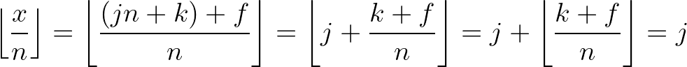


#### Lemma 3

If all of *a*, *b*, *c*, and *n* are integers with *b* ≠ 0 and *c* > 0, we can eliminate the inner floor in:


Proof: By lemmas 1 and 2 we have


## BigIntSqrt Proof

Recall that the series for computing *BigIntSqrt*(*n*) when integer *n* > 0 consists of


Also let's define


Given *n* ≥ 1, we have *s* ≥ 1 and *x*<sub>0</sub> is an integer greater than 0. All subsequent terms of the series are also integers due to the definition of *x*<sub>*i*+1</sub>. Next we'll show by induction that all terms of the series after the zeroth one (i.e. *x*<sub>*i*</sub> with *i* > 0) are greater than or equal to *s*.

### Lower bound on BigIntSqrt series terms

Suppose *x*<sub>*i*</sub> ≥ 1. We'll show that *x*<sub>*i*+1</sub> ≥ *s*.

The square of any real number is nonnegative, so we have


We can divide both sides by the positive quantity 2*x*<sub>*i*</sub> and simplify to get


Taking the floor of both sides and then using lemma 3 we get


Thus *x*<sub>*i*+1</sub> ≥ *s* ≥ 1, which completes the induction.

### Upper bound on BigIntSqrt series terms

We already know that *x*<sub>*i*</sub> ≥ *s* for all *i* > 0. Now suppose *x*<sub>*i*</sub> > *s* for some *i*. We'll show that *x*<sub>*i+1*</sub> < *x*<sub>*i*</sub> so the series is strictly decreasing as long as terms are greater than *s*.

*x*<sub>*i*</sub> and *s* are integers, so *x*<sub>*i*</sub> > *s* implies


By the definition of *s*, we get


Combining the above two inequalities yields


Squaring both sides (which is valid because the function *f*(*a*) = *a*<sup>2</sup> is monotonically increasing for positive *a*) and then adding *x*<sub>*i*</sub><sup>2</sup> to both sides results in


Dividing both sides by the positive value 2*x*<sub>*i*</sub> we get


Applying lemma 3 yields the upper bound on *x*<sub>*i*+1</sub>.


Combining the upper bound with the lower bound, we get


There are only finitely many integers between *s* and *x*<sub>*i*</sub> so the series must decrease on each step (other than the zeroth because we don't necessarily have *x*<sub>0</sub> > *s*) and eventually reach *x*<sub>*k*</sub> = *s* for some *k*. At that point the series cannot decrease further, so we can detect *x*<sub>*k*</sub> = *s* by looking for *k* > 0 and *x*<sub>*k+1*</sub> ≥ *x*<sub>*k*</sub>.


## BigIntCbrt Proof

The series for computing *BigIntCbrt*(*n*) when integer *n* > 0 consists of


Also let's define

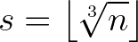

Given *n* ≥ 1, we have *s* ≥ 1 and *x*<sub>0</sub> is an integer greater than 0. All subsequent terms of the series are also integers due to the definition of *x*<sub>*i*+1</sub>. Next we'll show by induction that all terms of the series after the zeroth one (i.e. *x*<sub>*i*</sub> with *i* > 0) are greater than or equal to *s*.

### Lower bound on BigIntCbrt series terms

Suppose *x*<sub>*i*</sub> ≥ 1. We'll show that *x*<sub>*i*+1</sub> ≥ *s*.

The left factor is always positive and the right factor is the square of a real number which is always nonnegative, so we have

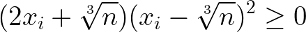

Expanding the products and collecting terms yields

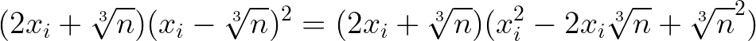
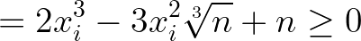

We can divide both sides by the positive quantity 3*x*<sub>*i*</sub><sup>2</sup> and simplify to get

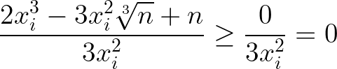
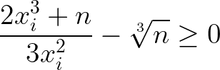

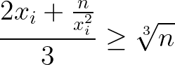

Taking the floor of both sides and then using lemma 3 we get

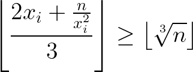
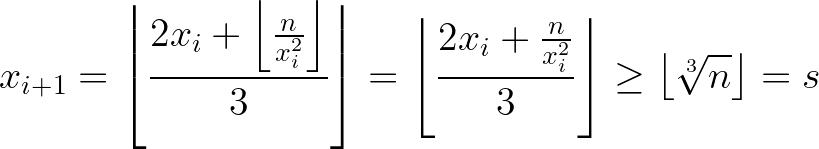

Thus *x*<sub>*i*+1</sub> ≥ *s* ≥ 1, which completes the induction.

### Upper bound on BigIntCbrt series terms

We already know that *x*<sub>*i*</sub> ≥ *s* for all *i* > 0. Now suppose *x*<sub>*i*</sub> > *s* for some *i*. We'll show that *x*<sub>*i+1*</sub> < *x*<sub>*i*</sub> so the series is strictly decreasing as long as terms are greater than *s*.

*x*<sub>*i*</sub> and *s* are integers, so *x*<sub>*i*</sub> > *s* implies


By the definition of *s*, we get

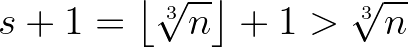

Combining the above two inequalities yields

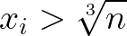

Cubing both sides (which is valid because the function *f*(*a*) = *a*<sup>3</sup> is monotonically increasing) and then adding 2*x*<sub>*i*</sub><sup>3</sup> to both sides results in

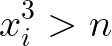
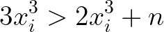

Dividing both sides by the positive value 3*x*<sub>*i*</sub><sup>2</sup> we get

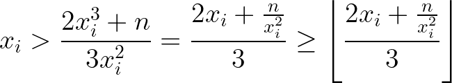

Applying lemma 3 yields the upper bound on *x*<sub>*i*+1</sub>.

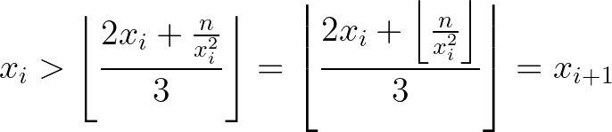

Combining the upper bound with the lower bound, we get


There are only finitely many integers between *s* and *x*<sub>*i*</sub> so the series must decrease on each step (other than the zeroth because we don't necessarily have *x*<sub>0</sub> > *s*) and eventually reach *x*<sub>*k*</sub> = *s* for some *k*. At that point the series cannot decrease further, so we can detect *x*<sub>*k*</sub> = *s* by looking for *k* > 0 and *x*<sub>*k+1*</sub> ≥ *x*<sub>*k*</sub>.

QED

